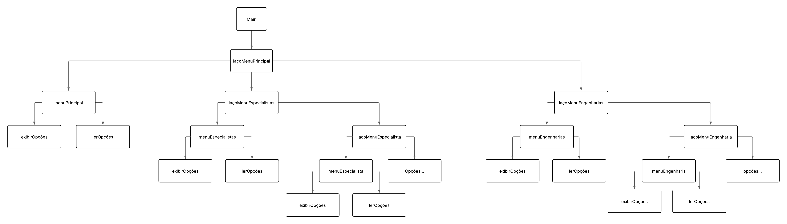

# Projeto Engenharia

## Diagrama hierárquico do menu



## Funções

### Especialista 1 : Geometria Analítica e Computacional

```haskell
 distanciaEntrePontos :: Ponto2D -> Ponto2D -> Distancia
```

 Recebe dois pontos 2D representados pelo tipo Ponto2D.<br/>
 Calcula a distância euclidiana entre os dois pontos.<br/>
 Devolve um valor do tipo Distancia (Double) representando a distância entre os pontos.<br/>

```haskell
distancia3D :: Ponto3D -> Ponto3D -> Distancia
```

Recebe dois pontos 3D representados pelo tipo Ponto3D.<br/> 
Calcula a distância euclidiana entre os dois pontos no espaço 3D.
<br/> Devolve um valor do tipo Distancia (Double) representando a distância entre os pontos.<br/>

```haskell
pontoMedio :: Ponto2D -> Ponto2D -> Ponto2D
```
Recebe dois pontos 2D representados pelo tipo Ponto2D.<br/>
Calcula o ponto médio entre os dois pontos.<br/>
Devolve um Ponto2D representando o ponto médio.<br/>

```haskell
 calcularArea :: Figura -> Area
```
Recebe um tipo algebrico Figura representando a figura desejada.<br/>
Verifica qual figura está sendo recebida (Retangulo, Circulo, Triangulo, Poligono, Cilindro, Esfera, Paralelepipedo)<br/>
Calcula a área correspondente de acordo com a figura.<br/>
Devolve um valor do tipo Area (Double) representando a área calculada.<br/>

```haskell
calcularPerimetro :: Figura -> Perimetro
```
Recebe uma figura geométrica representada pelo tipo algébrico Figura.<br/>
Verifica o tipo da figura (retângulo, círculo, triângulo, polígono) e aplica a fórmula adequada para calcular o perímetro.<br/>
Devolve um valor do tipo Perimetro representando o perímetro da figura.<br/>

```haskell
calcularVolume :: Figura -> Volume
```
Recebe uma figura tridimensional representada pelo tipo algébrico Figura.<br/>
Verifica o tipo da figura (esfera, cilindro, paralelepípedo) e aplica a fórmula de volume correspondente.<br/>
Devolve um valor do tipo Volume representando o volume da figura.<br/>

```haskell
intersecaoRetas :: (Ponto2D, Ponto2D) -> (Ponto2D, Ponto2D) -> Maybe Ponto2D
```
Recebe duas retas, cada uma representada por um par de pontos bidimensionais (Ponto2D).<br/>
Verifica se as retas são coincidentes, paralelas ou se possuem um ponto de interseção único.<br/>
Devolve Nothing caso não haja ponto único de interseção, ou Just Ponto2D quando existe.<br/>


### Especialista 2: Álgebra Linear e Operações com Matrizes

```haskell
somarMatrizes :: Matriz -> Matriz -> Maybe Matriz
```

Recebe duas matrizes do tipo algébrico Matriz. <br/>
Verifica se ambas possuem as mesmas dimensões. <br/>
Realiza a soma elemento a elemento entre as duas matrizes. <br/>
Retorna Just Matriz com o resultado da soma ou Nothing se forem incompatíveis. <br/>

```haskell
dimensoesIguais :: [[Double]] -> [[Double]] -> Bool
```

Recebe duas listas de listas de Double representando matrizes. <br/>
Verifica se ambas possuem o mesmo número de linhas e colunas. <br/>
Retorna True se forem compatíveis ou False caso contrário.<br/>

```haskell
multiplicarMatrizes :: Matriz -> Matriz -> Maybe Matriz
```

Recebe duas matrizes do tipo algébrico Matriz. <br/>
Verifica se o número de colunas da primeira é igual ao número de linhas da segunda. <br/>
Realiza a multiplicação matricial utilizando transposição e produto escalar. <br/>
Retorna Just Matriz com o resultado ou Nothing se forem incompatíveis. <br/>

```haskell
transpostaMatriz :: Matriz -> Matriz
```

Recebe uma matriz do tipo algébrico Matriz. <br/>
Aplica a transposição da matriz, trocando linhas por colunas. <br/>
Retorna uma nova Matriz transposta.<br/>

```haskell
determinante :: Matriz -> Maybe Double
```

Recebe uma matriz do tipo algébrico Matriz. <br/>
Verifica se a matriz possui dimensão 1x1, 2x2 ou 3x3. <br/>
Calcula o determinante utilizando o método de Sarrus.<br/>
Retorna Just Double com o valor do determinante ou Nothing se a matriz não for quadrada ou tiver dimensão inválida. <br/>

```haskell
resolverSistemaLinear :: Matriz -> Vetor -> Maybe Vetor
```

Recebe uma matriz quadrada do tipo Matriz e um vetor de termos independentes do tipo Vetor. <br/>
Verifica se o sistema é compatível e se a matriz é invertível. <br/>
Resolve o sistema linear utilizando o método de Cramer. <br/>
Retorna Just Vetor com a solução ou Nothing se não houver solução única. <br/>

```haskell
produtoEscalar :: Vetor -> Vetor -> Maybe Double
```

Recebe dois vetores do tipo algébrico Vetor. <br/>
Verifica se os vetores possuem o mesmo tamanho. <br/>
Calcula o produto escalar entre os dois vetores. <br/>
Retorna Just Double com o resultado ou Nothing se forem incompatíveis. <br/>

```haskell
normaVetor :: Vetor -> Double
```

Recebe um vetor do tipo algébrico Vetor. <br/>
Calcula a norma do vetor (comprimento). <br/>
Retorna um Double representando a norma. <br/>

```haskell
anguloEntreVetores :: Vetor -> Vetor -> Maybe Angulo
```

Recebe dois vetores do tipo algébrico Vetor. <br/>
Verifica se os vetores são compatíveis e não nulos. <br/>
Calcula o ângulo entre os vetores usando produto escalar e norma. <br/>
Retorna Just Angulo em radianos ou Nothing se não for possível calcular. <br/>

### Especialista 3: Cálculo Diferencial e Integral

```haskell
avaliarFuncao :: Funcao -> Double -> Double
```

Recebe um tipo algebrico Funcao representando a função desejada. <br/>
Recebe um Double representado o valor que será aplicado na função. <br/>
Verifica qual função está sendo recebida pelo tipo algebrico, aplica o valor recebido de acordo com essa verificação. <br/>
Devolve um Double representando o valor da função com a aplicação desejada. <br/>

```haskell
derivadaNumerica :: Funcao -> Double -> Double
```

Recebe um tipo algebrico Funcao representando a função que deseja derivar.<br/>
Recebe um Double para calcular o valor da derivada naquele ponto. <br/>
Verifica qual foi o tipo algebrico foi recebido e calcula a derivada no ponto solicitado. <br/>
Retorna um Double representando o valor da derivada. <br/>

```haskell
integralNumerica :: Funcao -> Double -> Double -> Int -> Double
```

Recebe um tipo algebrico Funcao representando a função a integrar. <br/>
Recebe, na sequência, dois Doubles representado os limites de integração. <br/>
Recebe um Int representando a precisão da inetgral. <br/>
Verifica qual foi o tipo algebrico recebido e calcula a integral aplicando os limites de integração seguindo o Teorema Fundamental do Cálculo. <br/>
Retorna um Double representando o valor da integral.<br/>

```haskell
encontrarRaizes :: Funcao -> Double -> Double -> [Double]
```

Recebe uma função. <br/>
Recebe dois doubles indicando o intervalo no eixo x. <br/>
Verifica qual função chegou, faz o calculo da raíz e verifica intervalo. <br/>
Devolve uma lista contendo as raízes encontradas, lista vazia se não for encontrada nenhuma raíz. <br/>

```haskell
encontrarMaximo :: Funcao -> Double -> Double -> Maybe Double
```

Recebe uma função. <br/>
Recebe dois Doubles que indicam o intervalo no eixo x. <br/>
Separa o intervalo em vários pontos contínuos, acha o valor de todos esses pontos e encontra o maior dentre eles. (Quanto maior a divisão maior a precisão do resultado). <br/>
Retorna Just x onde x é o valor máximo da entrada ou Nothing se não houver máximo. <br/>

```haskell
encontrarMinimo :: Funcao -> Double -> Double -> Maybe Double
```
Recebe uma função. <br/>
Recebe dois Doubles que indicam o intervalo no eixo x. <br/>
Separa o intervalo em vários pontos contínuos, acha o valor de todos esses pontos e encontra o menor dentre eles. (Quanto maior a divisão maior a precisão do resultado). <br/>
Retorna Just x onde x é o valor minímo da entrada ou Nothing se não houver minímo. <br/>

```haskell
calcularComprimentoCurva :: Funcao -> Double -> Double -> Comprimento
```

Recebe uma função. <br/>
Recebe dois Doubles indicando o intervalo no eixo x. <br/>
Para funções lineares utiliza da hipotenusa para calcular, para funções quadráticas utiliza de integrais e derivadas. <br/>
Retorna o valor do tamanho da curva. <br/>

### Especialista 4: Algoritmos e Estruturas de Dados

```haskell
quickSort :: (Ord a) => [a] -> [a]
```
Recebe uma lista de elementos de um tipo que pode ser ordenado (Ord a => [a]). <br/>
Verifica se a lista está vazia; se não, seleciona o primeiro elemento como pivô. <br/>
Divide os elementos restantes em duas listas: menores ou iguais ao pivô e maiores que o pivô. <br/>
Aplica recursivamente o QuickSort em cada sublista. <br/>
Devolve uma lista ordenada do mesmo tipo ([a]) em ordem crescente.  <br/>

```haskell
mergeSort :: (Ord a) => [a] -> [a]
```
Recebe uma lista de elementos de um tipo que pode ser ordenado (Ord a => [a]). <br/>
Verifica se a lista está vazia ou contém apenas um elemento; se sim, retorna a lista como está. <br/>
Caso contrário, divide a lista em duas metades (left e right). <br/>
Aplica recursivamente o MergeSort em cada metade. <br/>
Une as duas metades ordenadas usando a função merge, comparando elemento a elemento. <br/>
Devolve uma lista ordenada do mesmo tipo ([a]) em ordem crescente. <br/>

```haskell
insertionSort :: (Ord a) => [a] -> [a]
```
Recebe uma lista de elementos de um tipo que pode ser ordenado (Ord a => [a]). <br/>
Verifica se a lista está vazia; se sim, retorna a lista como está. <br/>
Caso contrário, pega o primeiro elemento (x) e aplica recursivamente o InsertionSort no restante da lista. <br/>
Insere o elemento x na posição correta da lista ordenada usando a função auxiliar insert. <br/>
Devolve uma lista ordenada do mesmo tipo ([a]) em ordem crescente. <br/>

```haskell
 buscarProjeto :: Int -> [Projeto] -> Maybe Projeto
```
Recebe um identificador do tipo 'Int' representando o ID do projeto a ser buscado. <br/>
Recebe, na sequência, uma lista de projetos '[Projeto]'. <br/>
Percorre a lista verificando se algum projeto possui o ID igual ao fornecido. <br/>
Retorna 'Just Projeto' caso encontre o projeto correspondente. <br/>
Retorna 'Nothing' caso nenhum projeto com o ID informado seja encontrado. <br/>

```haskell
inserirOrdenado :: (Ord a) => a -> [a] -> [a]
```
Recebe um elemento do tipo 'a' que implementa a classe 'Ord', representando o valor a ser inserido. <br/>
Recebe, na sequência, uma lista ordenada de elementos do tipo '[a]'. <br/>
Percorre a lista para encontrar a posição correta onde o elemento deve ser inserido, mantendo a ordenação da lista. <br/>
Retorna uma nova lista do tipo '[a]' com o elemento inserido na posição correta. <br/>

```haskell
inserir :: (Ord a) => a -> ArvoreBinaria a -> ArvoreBinaria a
```
Recebe um elemento do tipo 'a' que implementa a classe 'Ord', representando o valor a ser inserido. <br/>
Recebe, na sequência, uma árvore binária de busca do tipo 'ArvoreBinaria a'. <br/>
Insere o elemento na posição correta da árvore, mantendo a propriedade da árvore binária de busca. <br/>
Retorna uma nova árvore do tipo 'ArvoreBinaria a' com o elemento inserido. <br/>
 
```haskell
construirArvore :: (Ord a) => [a] -> ArvoreBinaria a
```
Recebe uma lista de elementos do tipo 'a' que implementa a classe 'Ord'. <br/>
Percorre a lista inserindo cada elemento em uma árvore binária de busca vazia, utilizando a função 'inserir'. <br/>
Retorna uma árvore binária de busca do tipo 'ArvoreBinaria a' contendo todos os elementos da lista. <br/>
 
```haskell
buscarArvore :: (Ord a) => a -> ArvoreBinaria a -> Bool
```
Recebe um elemento do tipo 'a' que implementa a classe 'Ord', representando o valor a ser buscado. <br/>
Recebe, na sequência, uma árvore binária de busca do tipo 'ArvoreBinaria a'. <br/>
Percorre a árvore verificando se o elemento está presente, comparando com os valores dos nós e seguindo a propriedade da árvore binária de busca. <br/>
Retorna 'True' se o elemento for encontrado na árvore. <br/>
Retorna 'False' caso contrário. <br/>
 
```haskell
filtrarProjetos :: (Projeto -> Bool) -> [Projeto] -> [Projeto]
```
Recebe uma função do tipo 'Projeto -> Bool' que representa o critério de filtragem.  <br/>
Recebe, na sequência, uma lista de projetos '[Projeto]'.  <br/>
Percorre a lista aplicando a função de filtragem a cada projeto.  <br/>
Retorna uma nova lista contendo apenas os projetos que satisfazem o critério (para os quais a função retorna 'True').  <br/>

### Especialista 5: Validação, Relatórios e Interface
```haskell
validarProjeto :: Projeto -> [String]
```
Recebe um tipo algebrico Projeto representando o projeto a ser validado.<br/>
Verifica diversas regras de consistência do projeto:<br/>
ID positivo.<br/>
Nome não vazio e com tamanho aceitável.<br/>
Orçamento positivo.<br/>
Deve conter pelo menos um material válido.<br/>
Cada material deve ter densidade, resistência e custo positivos, e quantidade não negativa.<br/>
Data de término (se fornecida) não pode ser anterior à data de início.<br/>
Devolve uma lista de String com as mensagens de erro encontradas.<br/>
Se não houver erros, devolve uma lista vazia ([]).<br/>

```haskell
calcularCustoTotal :: Projeto -> Custo
```
Recebe um tipo algebrico Projeto representando o projeto desejado.<br/>
Percorre a lista de materiais do projeto e calcula o custo total multiplicando o custo de cada material pela sua quantidade.<br/>
Soma todos os valores para obter o custo total do projeto.<br/>
Devolve um valor do tipo Custo (Double) representando o custo total calculado.<br/>

```haskell
formatarMaterial :: Material -> String
```
Recebe um tipo álgebrico Material  <br/>
Concatena informações do material com separadores e labels informativos.  <br/>
Retorna uma string formatada completa do material.  <br/>

```haskell
formatarCalculo :: CalculoMat -> String
```
Recebe um tipo álgebrico CalculoMat  <br/>
Concatena informações do cálculo com separadores.<br/>
Retorna uma string formatada completa do cálculo.  <br/>

```haskell
formatarFuncao :: Funcao -> String
```
Recebe um tipo álgebrico Funcao  <br/>
Concatena ddescrição da função com separadores.<br/>
Retorna uma string formatada completa da função.  <br/>

```haskell
gerarRelatorioProjeto :: Projeto -> [String]
```
Recebe um tipo álgebrico Projeto  <br/>
Constroi diversas listas de string separando as listas por tópicos de acordo com as infromações e concatena todas no final gerando uma lista única.<br/>
Retorna uma lista de strings com as informações.  <br/>

```haskell
compararLinha :: String -> String -> String -> String
```
Recebe uma string para representar qual atributo vai ser comparado.  <br/>
Recebe duas strings na sequência com os valores a serem comparados. <br/>
Verifica se o atributo é igual ou diferente nos dois projetos e monta uma string formatada do atributo.<br/>
Devolve uma string formatada da linha do atributo <br/>

```haskell
compararLinha :: String -> String -> String -> String
```
Recebe dois valores de orçamento (Float) representando os custos de dois projetos. <br/>
Converte cada valor em string no formato monetário com o prefixo "R$". <br/>
Verifica se os orçamentos são iguais, maior ou menor em relação ao outro projeto. <br/>
Devolve uma string formatada comparando os dois orçamentos e indicando o resultado da comparação. <br/>

```haskell
showMaybeData :: Maybe Day -> String
```
Recebe um Maybe Data  <br/>
Verifica se a data está definada ou não, se estiver converte para string<br/>
Devolve uma string da data sem o Just <br/>

```haskell
compararProjetos :: Projeto -> Projeto -> String
```
Recebe dois tipos álgebricos Projeto.  <br/>
Utiliza das funções anteriores para verificar cada atributo do projeto e monta um relatório.<br/>
Devolve uma string que representa o relatório de comparação dos dois projetos recebidos.<br/>

```haskell
estatisticasBasicas :: [Double] -> (Double, Double, Double)
```
Recebe uma lista de números reais ([Double]). <br/>
Calcula três estatísticas básicas sobre os elementos da lista: Média, Máximo e Mínimo. <br/>
Retorna uma tripla com os três valores calculados no formato (Média, Máximo, Mínimo). <br/>
Retorna (0, 0, 0) como valor padrão se a lista estiver vazia. <br/>

```haskell
contarPorTipo :: [Projeto] -> [(TipoProjeto, Int)]
```
Recebe uma lista de Projetos (tipos álgebricos Projeto). <br/>
Verifica o campo tipoProjeto de cada projeto e conta quantas ocorrências existem de cada tipo (Civil, Mecanica, Eletrica, Estrutural). <br/>
Filtra os resultados para incluir apenas os tipos que possuem pelo menos um projeto associado. <br/>
Retorn uma lista de pares (TipoProjeto, Int) representando a quantidade de projetos por tipo. <br/>

```haskell
projetosEmAtraso :: [Projeto] -> Day -> [Projeto]
```
Recebe uma lista de projetos e uma data de referência (Day). <br/>
Para cada Projeto, verifica se possui uma data de fim definida (Just fim), se ainda não foi concluído (status /= Concluido) e se a data de fim já passou em relação à data atual (fim < dataAtual). Projetos sem data de fim (Nothing) são ignorados.<br/>
Retorna uma lista contendo os projetos que estão em atraso. <br/>

### Engenharia Civil
```haskell
momentoInerciaRetangular :: Largura -> Altura -> MomentoInercia
```
Recebe a largura e a altura da seção retangular representadas pelos tipos Largura e Altura.<br/>
Calcula o momento de inércia da seção usando a fórmula (b * h^3) / 12.<br/>
Devolve um valor do tipo MomentoInercia (Double) representando o momento de inércia da seção.<br/>

```haskell
tensaoNormal :: Forca -> Area -> Pressao
```
Recebe a força aplicada e a área da seção representadas pelos tipos Forca e Area.<br/>
Calcula a tensão normal dividindo a força pela área.<br/>
Devolve um valor do tipo Pressao (Double) representando a tensão normal na seção.<br/>

```haskell
deflexaoViga :: Forca -> Comprimento -> ModuloElasticidade -> MomentoInercia -> Distancia
```
Recebe a força aplicada, comprimento da viga, módulo de elasticidade e momento de inércia da seção representados pelos tipos Forca, Comprimento, ModuloElasticidade e MomentoInercia.<br/>
Calcula a deflexão máxima usando a fórmula (F * L^3) / (48 * E * I).<br/>
Devolve um valor do tipo Distancia (Double) representando a deflexão máxima da viga.<br/>

```haskell
cargaCriticaEuler :: ModuloElasticidade -> MomentoInercia -> Comprimento -> Forca
```
Recebe o módulo de elasticidade, momento de inércia da seção e comprimento da coluna representados pelos tipos ModuloElasticidade, MomentoInercia e Comprimento.<br/>
Calcula a carga crítica usando a fórmula (π^2 * E * I) / L^2.<br/>
Devolve um valor do tipo Forca (Double) representando a carga máxima que a coluna pode suportar antes de flambar.<br/>


```haskell
volumeConcreto :: Figura -> Volume
```

Recebe uma figura geométrica do tipo algébrico Figura. <br/>
Verifica qual tipo de figura foi recebida. <br/>
Calcula o volume de concreto necessário com base na fórmula da figura. <br/>
Retorna um Volume em metros cúbicos. <br/>

### Engenharia Mecânica

```haskell
calcularTorque :: Forca -> Distancia -> Angulo -> Torque
```

Recebe uma força (Forca), uma distância (Distancia) e um ângulo (Angulo). <br/>
Aplica a fórmula do torque: τ = F · r · sin(θ). <br/>
Retorna um Torque em Newton-metro. <br/>

```haskell
velocidadeAngular :: Velocidade -> Raio -> VelocidadeAngular
```

Recebe uma velocidade linear (Velocidade) e um raio (Raio). <br/>
Aplica a fórmula da velocidade angular: ω = v / r. <br/>
Retorna uma VelocidadeAngular em rad/s. Retorna 0 se o raio for nulo. <br/>

```haskell
aceleracaocentripeta :: Velocidade -> Raio -> Aceleracao
```

Recebe uma velocidade tangencial (Velocidade) e um raio (Raio). <br/>
Aplica a fórmula da aceleração centrípeta: a = v² / r. <br/>
Retorna uma Aceleracao em m/s². Retorna 0 se o raio for nulo. <br/>

```haskell
energiaCinetica :: Massa-> Velocidade-> Energia
```

Recebe uma tipo algebrico Massa e um tipo algebrico Velocidade. <br/>
Realiza o cálculo. <br/>
Retorna um tipo algebrico Energia com o resultado. <br/>

```haskell
energiaPotencial :: Massa-> Altura-> Energia
```

Recebe uma tipo algebrico Massa e um tipo algebrico Altura. <br/>
Realiza o cálculo. <br/>
Retorna um tipo algebrico Energia com o resultado. <br/>

```haskell
centroMassaX :: [(Massa, Distancia)]-> Distancia
```

Recebe uma lista contendo tuplas com o tipo algebrico Massa na primeira posição e na segunda posição o tipo algebrico Distancia. <br/>
Realiza o cálculo. <br/>
Retorna um tipo algebrico Distancia com o resultado. <br/>

### Engenharia Elétrica

```haskell
tensaoOhm :: Corrente-> Resistencia-> Tensao
```

Recebe uma tipo algebrico Corrente e um tipo algebrico Resistência. <br/>
Realiza o cálculo. <br/>
Retorna um tipo algebrico Tensao com o resultado. <br/>

```haskell
potenciaEletricaRI :: Resistencia -> Corrente -> PotenciaEletrica
```
Recebe um tipo algebrico Resistencia e um tipo algebrico Corrente. <br/>
Realiza o cálculo. <br/>
Retorna um tipo algebrico PotenciaEletrica com o resultado. <br/> 
 
```haskell
potenciaEletricaVR :: Tensao -> Resistencia -> PotenciaEletrica
```
Recebe um tipo algebrico Tensao e um tipo algebrico Resistencia. <br/>
Realiza o cálculo. <br/>
Retorna um tipo algebrico PotenciaEletrica com o resultado. <br/>

```haskell
resistenciaSerie :: [Resistencia] -> Resistencia
```
Recebe uma lista de resistências ([Resistencia]). <br/>
Realiza o cálculo da resistência equivalente de resistores ligados em série. <br/>
Retorna um tipo algebrico Resistencia com o resultado. <br/>

```haskell
resistenciaParalelo :: [Resistencia] -> Resistencia
```
Recebe uma lista de resistências ([Resistencia]). <br/>
Realiza o cálculo da resistência equivalente de resistores ligados em paralelo. <br/>
Retorna um tipo algebrico Resistencia com o resultado. <br/>

```haskell
impedanciaAC :: Resistencia -> Reatancia -> Impedancia
```
Recebe a resistência (R) e a reatância (X) de um circuito AC. <br/>
Calcula a magnitude da impedância, que é a raiz quadrada da soma dos quadrados de R e X. <br/>
Devolve um valor do tipo Impedancia (Double) representando a magnitude da impedância. <br/>

```haskell
polarParaRetangular :: Double -> Angulo -> (Double, Double)
```
Recebe um valor de magnitude (r) e um ângulo (theta) em radianos. <br/>
Converte as coordenadas polares para coordenadas retangulares (cartesianas). <br/>
Devolve uma tupla (x, y) representando as coordenadas retangulares correspondentes. <br/>

```haskell
retangularParaPolar :: Double -> Double -> (Double, Angulo)
```
Recebe as coordenadas retangulares (x, y). <br/>
Converte as coordenadas retangulares para coordenadas polares. <br/>
Devolve uma tupla (r, theta) onde: <br/>
    - r é a magnitude (distância da origem), <br/>
    - theta é o ângulo em radianos. <br/>
  
```haskell
potenciaEletricaVI :: Tensao -> Corrente -> PotenciaEletrica
```
Recebe a tensão (v) e a corrente (i) de um circuito elétrico. <br/>
Calcula a potência elétrica instantânea como o produto da tensão pela corrente. <br/>
Devolve um valor do tipo PotenciaEletrica (Double) representando a potência em watts. <br/>
